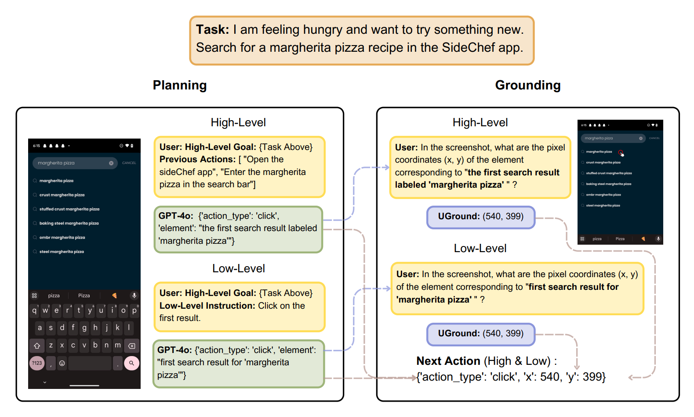

# AndroidControl Evaluation Pipeline

This folder contains the evaluation pipeline for the **AndroidControl** benchmark. 



You can download the **AndroidControl** test split images folder from [Hugging Face](https://huggingface.co/datasets/demisama/UGround-Offline-Evaluation/blob/main/AndroidControl_images.zip). The subfolder names represent `episode_id`, and each image is named `screenshot_{step}.png`.

For more information about the benchmark, please refer to the [Android Control's official repo](https://github.com/google-research/google-research/tree/master/android_control).

For more details on our experiments, please refer to **Sections 3.2** and **E.3** of [our paper](https://arxiv.org/pdf/2410.05243).

### Quick Start

To use our sample of 500 steps, skip to **step 2: gpt_plan** and use `data/500_steps`.

To use our GPT-4o generated plan results, skip to **step 4: Grounding Model Inference** and use `data/query_gpt-4o_{level}.jsonl` as the question file.

### Pipeline Steps

**1. `sample.py`**

Sample a subset of data from the whole dataset.

```bash
python sample.py --input_file <full_test_steps_json> --output_file <sample_json> -n <num_samples>
```

The `input_file` was generated by processing the original AndroidControl data according to the rules specified in the paper. You can download it from [Hugging Face](https://huggingface.co/datasets/demisama/UGround-Offline-Evaluation/blob/main/AndroidControl_processed_test_steps.json). As in the paper, we use n=500, and the samples are in `data/500_steps`.

**2. `gpt_plan.py`**

Generate plan files using GPT models.

```bash
export OPENAI_API_KEY="Your OpenAI API Key"
python gpt_plan.py --model <gpt_model> --input_file <sample_jsonl> --output_file <plan_jsonl> --screenshot_dir <screenshot_dir> --level <task_level>
```

- For `gpt_model`, we use `gpt-4o-2024-05-13` and `gpt-4-turbo-2024-04-09`.
- `level` can be "high" or "low".

The GPT-4o-generated plan files we use are in `data/plan_gpt-4o_{level}.jsonl`.

**3. `extract_grounding_query.py`**

Extract grounding queries from the plan files.

```bash
python extract_grounding_query.py --sample_file <sample_jsonl> --input_file <plan_jsonl> --output_file <query_jsonl> --screenshot_dir <screenshot_dir>
```

The queries extracted from GPT-4o plan files are in `data/query_gpt-4o_{level}.jsonl`.

**4. Grounding Model Inference**

Perform grounding model inference using the query file generated in the previous step. 

To use **UGround-V1**, please refer to the [UGround-V1 Inference Guidelines](https://github.com/OSU-NLP-Group/UGround/tree/main/grounding) and the scripts provided in the `../../grounding` folder.

To compare with our results, use `data/query_gpt-4o_{level}.jsonl` as the question file.

**5. `eval.py`**

Evaluate the Step Accuracy and Grounding Accuracy based on plan and grounding results. 

```bash
python eval.py --sample_file <sample_jsonl> --plan_file <plan_jsonl> --ans_file <grounding_answer_jsonl>
```

To compare with our results, use the following:
- `data/500_steps` as the `sample_file`
- `data/plan_gpt-4o_{level}.jsonl` as the `plan_file`
- The `ans_file` should be inferred from `data/query_gpt-4o_{level}.jsonl`.
