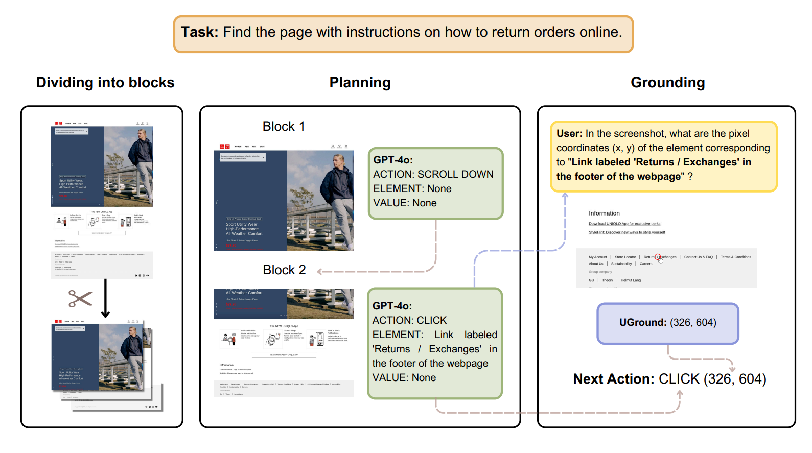

# Multimodal-Mind2Web Evaluation Pipeline

This folder contains our evaluation pipeline for the **Multimodal-Mind2Web** benchmark. 



You can download the Multimodal-Mind2Web dataset from [Hugging Face](https://huggingface.co/datasets/osunlp/Multimodal-Mind2Web).

For more details on our experiments, please refer to **Sections 3.2** and **E.2** of [our paper](https://arxiv.org/pdf/2410.05243).

### Quick Start

To use the `1280x1000` screenshot blocks we generated, skip to **step 3: gpt_plan** and use `data/samples/cross_{split}_blocks.jsonl`.

To use our GPT-4o generated plan results, skip to **step 5: Grounding Model Inference** and use `data/{gpt_model}_results/cross_{split}_query.jsonl` as the question file.


### Pipeline Steps

**1. `sample.py`**

Preprocess the dataset and sample tasks.

```bash
python sample.py --input_dir <dataset_dir> --output_dir <sample_dir> --samples_per_split <num_samples>
```

- `input_dir`: Download the **Multimodal-Mind2Web Dataset** from [Hugging Face](https://huggingface.co/datasets/osunlp/Multimodal-Mind2Web/tree/main/data).
- `output_dir`: The folder where the sampled data and images will be stored.  
  The sampled data will be saved in `cross_{split}/sample.jsonl`, and the images will be stored in `cross_{split}/images`.  
  `split` can be `task`, `website`, or `domain`.

**2. `make_blocks.py`**

Split full screenshots into blocks.

```bash
python make_blocks.py --input_file <sample_jsonl> --output_file <sample_blocks_jsonl> --image_folder <screenshots_dir> --output_folder <blocks_dir>
```

The sample_blocks.jsonl files, generated with the parameters `output_size = [1280, 1000]` and `padding = 200` (as used in our paper), can be found in `data/samples/cross_{split}_blocks.jsonl`.   

The generated screenshot block images are available at [Hugging Face](https://huggingface.co/datasets/demisama/UGround-Offline-Evaluation/blob/main/Multimodal-Mind2Web_blocks_images.zip). Due to image processing errors, we missed 11 data points from the dataset.

In the `sample_blocks.jsonl` files:
- The `blocks_path` field follows the format `'annotation_id'_'action_uid'`, which corresponds to the subfolder names in the `blocks_images` folder. Each image within these subfolders is named according to its block number (starting from 0).
- The `target_blocks` field contains information in the format `{"block_num": [list of bounding box coordinates for target elements in that block]}`.   

**3. `gpt_plan.py`**

Generate plan files using GPT models.

```bash
export OPENAI_API_KEY="Your OpenAI API Key"
python gpt_plan.py --gpt_model <model_name> --input_file <sample_blocks_jsonl> --output_file <plan_jsonl> --blocks <blocks_dir>
```

- `gpt_model` can be "gpt-4o" or "gpt-4-turbo"
- `split` can be "domain", "task", or "website"

The plan results, generated by GPT from the above `sample_blocks` file, can be found in `data/{gpt_model}_results/cross_{split}_plan.jsonl`.

**4. `extract_grounding_query.py`**

Extract grounding queries from the plan files.

```bash
python extract_grounding_query.py --input_file <plan_jsonl> --output_file <query_jsonl> --blocks <blocks_dir>
```

The queries extracted from the plan files are located in `data/{gpt_model}_results/cross_{split}_query.jsonl`.

**5. Grounding Model Inference**

Perform grounding model inference using the query file generated in the previous step. 

To use **UGround-V1**, please refer to the [UGround-V1 Inference Guidelines](https://github.com/OSU-NLP-Group/UGround/tree/main/grounding) and the scripts provided in the `grounding` folder.

To compare with our results, use `data/{gpt_model}_results/cross_{split}_query.jsonl` as the question file.

**6. `eval.py`**

Evaluate the Element Accuracy, Operation F1 and Step Success Rate based on plan and grounding results.

```bash
python eval.py --sample_file <blocks_jsonl> --plan_file <plan_jsonl> --ans_file <grounding_answer_jsonl> --blocks <blocks_dir>
```

To compare with our results, use the following:
- `data/samples/cross_{split}_blocks.jsonl` as the `sample_file`
- `data/{gpt_model}_results/cross_{split}_plan.jsonl` as the `plan_file`
- The `ans_file` should be inferred from `data/{gpt_model}_results/cross_{split}_query.jsonl`.  

If you would like to use your own scripts for sampling, planning, and querying, please refer to `file_schemas.py`, which defines the required fields for the `sample_jsonl`, `sample_blocks_jsonl`, `plan_jsonl`, `query_jsonl`, and `ans_jsonl` files.