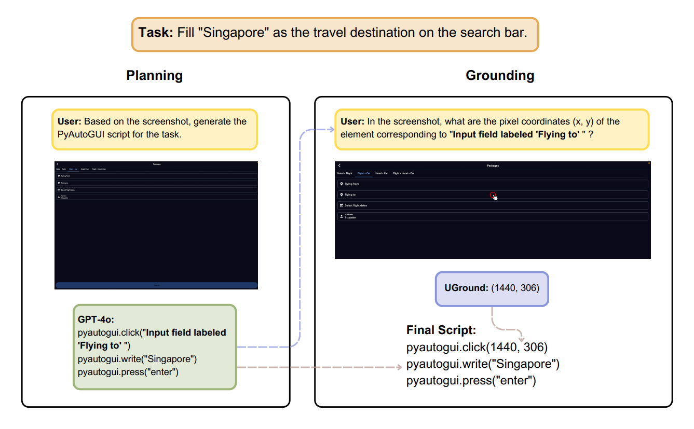

# OmniACT Evaluation Pipeline

This folder contains our evaluation pipeline for the **OmniACT** benchmark, which focuses on evaluating performance of multimodal agents on desktop and web platforms.



You can download the **OmniACT** dataset from [Hugging Face](https://huggingface.co/datasets/Writer/omniact/tree/main).

For more details on our experiments, please refer to **Sections 3.2** and **E.4** of [our paper](https://arxiv.org/pdf/2410.05243).

### Quick Start

To use our processed test data and generated task embeddings, skip to **step 3: gpt_plan** and use `processed_test.json` as the sample file and `data/train_embeddings.jsonl` as the embedding file.

To use our GPT-4o generated plan results, skip to **step 5: Grounding Model Inference** and use `data/gpt-4o_query.jsonl` as the question file.


### Pipeline Steps

**1. `sample.py`**

   Preprocess the dataset (modify invalid file paths to ensure they are correct) and sample tasks.

   ```bash
   python sample.py --base_path <path_to_dataset> --test_file <path_to_test_json> --output_file <path_to_sample_json> --sample_num <num_samples>
   ```

   - `base_path` corresponds to the folder of the OmniACT dataset, which you can download from [Hugging Face](https://huggingface.co/datasets/Writer/omniact/tree/main).
   - `test_file` is the `test.json` file from the dataset.

   We use the full test split, the processed file can be found in `data/processed_test.json`.

**2. `embed_examples.py`**

   Generate in-context training task embeddings, which can be used for retrieval during plan generation to find the top 5 similar tasks for in-context learning inference.

   ```bash
   python embed_examples.py --base_path <path_to_dataset> --train_file <path_to_train_json> --output_file <path_to_output_embeddings>
   ```

   - `train_file` refers to the `train.json` file in the OmniACT dataset.
   
   For more details, refer to **Section 6** of the [OmniACT's paper](https://arxiv.org/pdf/2402.17553).

**3. `gpt_plan.py`**

   Generate plan files using a GPT model and the embeddings.

   ```bash
   export OPENAI_API_KEY="Your OpenAI API Key"
   python gpt_plan.py --gpt_model <gpt_model> --embedding_file <path_to_embedding_file> --sample_path <path_to_sample_json> --base_path <path_to_dataset> --output_path <path_to_output_plan>
   ```

   - For `gpt_model`, we use `gpt-4o-2024-05-13` and `gpt-4-turbo-2024-04-09`.
   - To use our processed test data, set `sample_path` to `data/processed_test.json`.
   - To use our generated embeddings, set `embedding_file` to `data/train_embeddings.jsonl`.

   The plan results generated by GPT-4o can be found in `data/gpt-4o_plan.jsonl`.

**4. `extract_grounding_query.py`**

   Evaluate the sequence score from the generated plan files and extract grounding queries in one step.

   ```bash
   python extract_grounding_query.py --plan_file <path_to_plan_file> --base_path <path_to_dataset> --seq_output_file <path_to_seq_score_output> --query_output_file <path_to_grounding_query_output>
   ```

   The sequence score file and queries extracted from the plan files are located in `data/gpt-4o_seq.jsonl` and `data/gpt-4o_query.jsonl`.

**5. Grounding Model Inference**

   Perform grounding model inference using the query file generated in the previous step. 

   To use **UGround-V1**, please refer to the [UGround-V1 Inference Guidelines](https://github.com/OSU-NLP-Group/UGround/tree/main/grounding) and the scripts provided in the `../../grounding` folder.

   To compare with our results, use `data/gpt-4o_query.jsonl` as the question file.

**6. `eval_action.py`**

   Evaluate the action score based on the sequence score file and grounding results.

   ```bash
   python eval_action.py --base_path <path_to_dataset> --seq_file <path_to_seq_score_file> --ans_file <path_to_grounding_answer_file>
   ```

   To compare with our results, use the following:
   - `base_path`: OmniACT dataset folder.
   - `seq_file`: `data/gpt-4o_seq.jsonl`.
   - The `ans_file` should be inferred from `data/gpt-4o_query.jsonl`.

**`file_schemas.py`** defines the required fields for the `plan_jsonl`, `query_jsonl`, `seq_jsonl`, and `ans_jsonl` files.